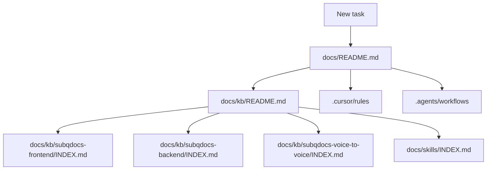

# SubQDocs — workspace documentation

**Last reviewed:** 2026-04-02 · **Doc set:** 1

Single entry for **engineering documentation** in this monorepo: what lives in `docs/`, `.cursor/`, `.agents/`, and `.gemini/`, and **in what order** to read material for a task.

**Parent index for the knowledge base only:** If you already know you need product rules or app landmarks, go straight to [`kb/README.md`](./kb/README.md).

---

## Read this first (recommended order)

| Step | Open | Why |
|------|------|-----|
| 1 | [`kb/README.md`](./kb/README.md) | What SubQDocs is, architecture, stack conventions, links to per-app KB hubs (frontend, backend, voice). |
| 2 | [`kb/subqdocs-frontend/INDEX.md`](./kb/subqdocs-frontend/INDEX.md), [`kb/subqdocs-backend/INDEX.md`](./kb/subqdocs-backend/INDEX.md), or [`kb/subqdocs-voice-to-voice/INDEX.md`](./kb/subqdocs-voice-to-voice/INDEX.md) | Deep docs for the app you are changing (domains / modules / voice service). |
| 3 | [`skills/INDEX.md`](./skills/INDEX.md) | Before a **concrete operation** (new route, S3 upload, socket, migration, …), load the matching numbered skill by trigger phrase. |
| 4 | [`kb/maintenance.md`](./kb/maintenance.md) | After **structural** code changes, update the KB (and hooks inventory where relevant) in the same change set. |

---

## Folder map

### `docs/` (this tree) — canonical narrative + procedures

| Path | Role | Primary audience |
|------|------|------------------|
| [`kb/`](./kb/) | Knowledge base: product overview, PHI, architecture, stack conventions, `subqdocs-frontend` / `subqdocs-backend` / `subqdocs-voice-to-voice` deep docs, hooks | Humans, Cursor `@`, Antigravity when bootstrapping |
| [`skills/`](./skills/) | Numbered procedural skills (how-to checklists) | Any agent before executing a listed operation |

**KB vs skills:** KB answers *what/where* (landmarks, domains, modules). Skills answer *how* (safe steps). [`kb/maintenance.md`](./kb/maintenance.md) ties code changes to doc updates.

**Legacy note:** Older repos used `AI-CONTEXT` / `*-context.md` names. Here, use [`kb/project/overview.md`](./kb/project/overview.md), [`kb/frontend/conventions.md`](./kb/frontend/conventions.md), and [`kb/backend/conventions.md`](./kb/backend/conventions.md).

---

### `.cursor/` — Cursor IDE only

| Path | Role |
|------|------|
| [`.cursor/rules/*.mdc`](../.cursor/rules/) | Cursor project rules (`globs`, `alwaysApply`). [`.cursor/rules/project-workflow-alignment.mdc`](../.cursor/rules/project-workflow-alignment.mdc) points at [`kb/ai-documentation-standards.md`](./kb/ai-documentation-standards.md). Scoped rules (e.g. `subqdocs-backend-modules.mdc`, `subqdocs-frontend-domains.mdc`) use narrow globs and link into `docs/kb/`; see [`kb/ai-documentation-standards.md`](./kb/ai-documentation-standards.md) stable paths. |
| [`.cursor/AGENT.md`](../.cursor/AGENT.md) | Task Planning Agent — strict workflow for `plans/*.md` (approval gates). |
| [`.cursor/mcp.json`](../.cursor/mcp.json) | MCP config (e.g. Figma, GitHub, filesystem) used during planning. |

**Canonical narrative** for the Task Planning Agent (artifact map, MCP notes, smoke test) is [`docs/kb/cursor-task-planning-agent.md`](./kb/cursor-task-planning-agent.md). The knowledge base lives only under **`docs/kb/`** (not under `.cursor/`). Antigravity and other tools **do not** load `.cursor/rules` unless explicitly configured. Treat these as **Cursor guardrails**.

---

### `.agents/` — Antigravity workflows and hard rules

| Path | Role |
|------|------|
| [`.agents/rules/production-rules.md`](../.agents/rules/production-rules.md) | Non-negotiable workspace rules (PHI, `organization_id`, Sequelize `parse`, Joi, Formik, etc.). |
| [`.agents/workflows/`](../.agents/workflows/) | Named playbooks (feature master, PR review, TOOL-add-*, CW*). See [`.agents/README.md`](../.agents/README.md). |

---

### `.gemini/` — session artifacts (not source of truth)

| Path | Role |
|------|------|
| [`.gemini/artifacts/`](../.gemini/artifacts/) | Point-in-time plans from Gemini-assisted work. Confirm anything important against [`docs/kb/`](./kb/). See [`.gemini/README.md`](../.gemini/README.md). |

### Local editor folders (not KB, not Antigravity)

| Path | Role |
|------|------|
| [`.vscode/`](../.vscode/) | Optional VS Code workspace settings (for example Git detection in nested repos). Not part of the knowledge base or Cursor rules. |
| `.idea/` | JetBrains caches and project metadata — listed in [`.gitignore`](../.gitignore); do not commit. |

Do **not** add a separate `ai-context/` tree at the repo root; canonical product and stack narrative is [`docs/kb/`](./kb/). Antigravity playbooks and hard rules stay under [`.agents/`](../.agents/).

---

## Cursor vs Antigravity

| Tool | Reads by default | Use for |
|------|------------------|---------|
| **Cursor** | `.cursor/rules`, editor context; you can `@` files under `docs/` | Day-to-day editing with project rules and KB in context. |
| **Antigravity** | `.agents/workflows`, `.agents/rules/production-rules.md`; should follow each workflow’s bootstrap (often `docs/kb` + `docs/skills`) | Orchestrated flows: full feature delivery, PR review, scaffolding TOOLs. |

**Both** must respect PHI, tenancy, and “never do” items in [`kb/project/overview.md`](./kb/project/overview.md) and [`production-rules.md`](../.agents/rules/production-rules.md).

---

## Stable paths for `@` (repo root)

**Full list:** [`kb/ai-documentation-standards.md`](./kb/ai-documentation-standards.md#stable-paths-repo-root).

Quick picks: `docs/README.md` (this file), [`kb/README.md`](./kb/README.md), [`kb/ai-documentation-standards.md`](./kb/ai-documentation-standards.md), [`kb/anti-patterns.md`](./kb/anti-patterns.md), [`kb/subqdocs-voice-to-voice/INDEX.md`](./kb/subqdocs-voice-to-voice/INDEX.md), [`skills/INDEX.md`](./skills/INDEX.md), [`.agents/README.md`](../.agents/README.md), [`.agents/workflows/FEATURE-IMPLEMENTATION-MASTER.md`](../.agents/workflows/FEATURE-IMPLEMENTATION-MASTER.md), [`.agents/rules/production-rules.md`](../.agents/rules/production-rules.md).

---

## Related

- **AI context (bootstrap, `@` paths):** [`kb/ai-documentation-standards.md`](./kb/ai-documentation-standards.md)
- **Doc update policy:** [`kb/maintenance.md`](./kb/maintenance.md)
- **Antigravity workflow index:** [`.agents/README.md`](../.agents/README.md)
- **Gemini artifacts:** [`.gemini/README.md`](../.gemini/README.md)

---

## Mermaid: where to look first

