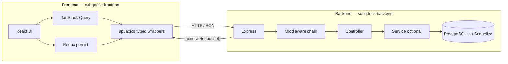

# SubQDocs — Architecture

High-level diagram and repository landmarks. Deep rules and stack detail live in the companion docs below.

| Document | Role |
|----------|------|
| [`overview.md`](./overview.md) | Product scope, request flow, sockets, uploads, PDF, PHI/auth rules |
| [`../frontend/conventions.md`](../frontend/conventions.md) | React/Vite stack, API layer, Redux/Query, conventions |
| [`../backend/conventions.md`](../backend/conventions.md) | Express/Sequelize stack, modules, models, jobs |
| [Backend KB hub](../subqdocs-backend/INDEX.md) | `subqdocs-backend` — entry points, shared layer, module docs |
| [Frontend KB hub](../subqdocs-frontend/INDEX.md) | `subqdocs-frontend` — routes, state, domains |

**Stable `@` paths (full list):** [`../ai-documentation-standards.md`](../ai-documentation-standards.md#stable-paths-repo-root).

---

## System context

SubQDocs is a **medical practice management platform**: AI visit notes (voice → Deepgram → LangGraph SOAP), scheduling, records, billing, prescriptions/labs/pathology, e-fax (Westfax), digital consent/intake, EHR sync (EMA, Optum), Stripe org billing, and calendar with recurrence.

---

## Request path (happy path)

1. Frontend actions use typed Axios wrappers (`axiosGet`, `axiosPost`, …), not raw `axios`.
2. Backend: Express → middleware → controller → optional service → Sequelize/PostgreSQL.
3. Responses flow through `generalResponse()`; the frontend interceptor handles `401` (logout) and `404` (redirect) globally.

---

## Real-time and async

| Concern | Where |
|---------|--------|
| **Socket.io** | Same HTTP server as Express: `subqdocs-backend/src/socket.ts`. Auth: handshake token vs `users.token` (single session). Public namespace `/chatbot` (no auth). |
| **Background jobs** | BullMQ + Redis; cron in `server.ts` (`node-cron` jobs must `.start()`). |

---

## Cross-cutting integrations

| Integration | Notes |
|-------------|--------|
| **S3 / uploads** | Multipart and large files via shared S3 helpers; Multer routes bypass certain body parsers in `app.ts`. |
| **PDF** | Server: PDFKit streams. Client: PDF.js worker in `main.tsx`. |
| **AI pipeline** | Deepgram + LangChain/LangGraph on backend. |

---

## Repository landmarks

### Frontend (`subqdocs-frontend/src/`)

| Path | Purpose |
|------|---------|
| `constants/routePath.tsx` | Single source for routes |
| `api/axios.ts` | Typed HTTP; interceptors |
| `redux/store.ts` | Slice registration |
| `redux/ducks/`, `redux/dispatch/` | State and imperative dispatch |
| `lib/socketService.ts` | Socket.io client singleton |
| `components/common/svg/Svg.tsx` | Central SVG icons |
| `helper/laxywithRetry.ts` | Prefer over `React.lazy()` |
| `main.tsx` | PDF.js worker, Sentry |

### Backend (`subqdocs-backend/src/`)

| Path | Purpose |
|------|---------|
| `server.ts` | Routes, cron, workers |
| `app.ts` | Express, CORS, parsers, webhook/Multer exceptions |
| `socket.ts` | All Socket.io handlers |
| `sequelize/models/` + `models/index.ts` | ORM; new models must register |
| `sequelize/migrations/` | DB migrations |
| `sequelize/repository/` | Query helpers |
| `modules/<name>/` | Feature: `routes`, `controller`, `validation_schema`, `services`, optional `jobs` |
| `common/utils/generalResponse` | Standard API responses |
| `middlewares/auth.middleware.ts` | JWT → `req.user` |

---

## Rules that shape the architecture

- **Multi-tenancy:** Always filter by `organization_id` on patient/visit queries; never skip on PHI-bearing data.
- **Auth:** JWT stored in DB; dual-auth routes use `authOrIntakeSessionMiddleware` where documented.
- **Soft delete:** Patient/visit models use `paranoid: true` — no hard deletes for those records.
- **Stricter operational rules:** `.agents/rules/production-rules.md`; step-by-step skills under `docs/skills/`.

---

## Skills index

Operations that span layers (sockets, S3, background jobs) are documented in [`../../skills/INDEX.md`](../../skills/INDEX.md) — load the relevant skill before implementing.
